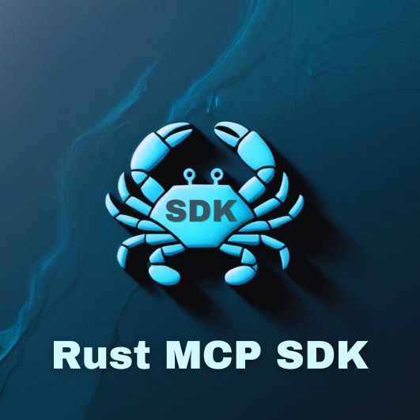
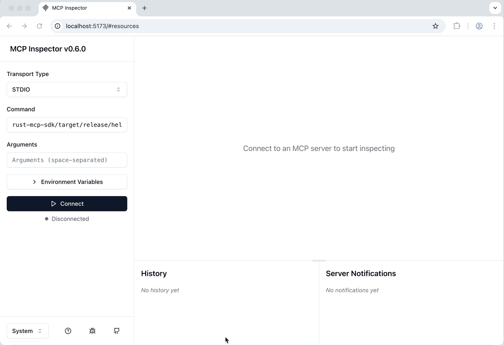

<p align="center">
  
</p>

# Rust MCP SDK

A high-performance, asynchronous toolkit for building MCP servers and clients.  
Focus on your app's logic while **rust-mcp-sdk** takes care of the rest!

**rust-mcp-sdk** provides the necessary components for developing both servers and clients in the MCP ecosystem.  
Leveraging the [rust-mcp-schema](https://github.com/rust-mcp-stack/rust-mcp-schema) crate for type safe MCP schema objects and MCP type utilities simplifies the process of building robust and reliable MCP servers and clients, ensuring consistency and minimizing errors in data handling and message processing.

**⚠️WARNING**: This project only supports Standard Input/Output (stdio) transport at this time, with support for SSE (Server-Sent Events) transport still in progress and not yet available. Project is currently under development and should be used at your own risk.

## Usage Examples

### MCP Server

Create a MCP server with a `tool` that will print a `Hello World!` message:

```rust
#[tokio::main]
async fn main() -> SdkResult<()> {

    // STEP 1: Define server details and capabilities
    let server_details = InitializeResult {
        // server name and version
        server_info: Implementation {
            name: "Hello World MCP Server".to_string(),
            version: "0.1.0".to_string(),
        },
        capabilities: ServerCapabilities {
            // indicates that server support mcp tools
            tools: Some(ServerCapabilitiesTools { list_changed: None }),
            ..Default::default() // Using default values for other fields
        },
        meta: None,
        instructions: Some("server instructions...".to_string()),
        protocol_version: LATEST_PROTOCOL_VERSION.to_string(),
    };

    // STEP 2: create a std transport with default options
    let transport = StdioTransport::new(TransportOptions::default())?;

    // STEP 3: instantiate our custom handler for handling MCP messages
    let handler = MyServerHandler {};

    // STEP 4: create a MCP server
    let server: ServerRuntime = server_runtime::create_server(server_details, transport, handler);

    // STEP 5: Start the server
    server.start().await

}
```

The implementation of `MyServerHandler` could be as simple as the following:

```rust

// STEP 1: Define a rust_mcp_schema::Tool ( we need one with no parameters for this example)
#[mcp_tool(name = "say_hello_world", description = "Prints \"Hello World!\" message")]
#[derive(Debug, Deserialize, Serialize, JsonSchema)]
pub struct SayHelloTool {}

// STEP 2: Implement ServerHandler trait for a custom handler
// For this example , we only need handle_list_tools_request() and handle_call_tool_request() methods.
pub struct MyServerHandler;

#[async_trait]
impl ServerHandler for MyServerHandler {
    // Handle ListToolsRequest, return list of available tools as ListToolsResult
    async fn handle_list_tools_request(&self, request: ListToolsRequest, runtime: &dyn MCPServer) -> Result<ListToolsResult, JsonrpcErrorError> {

        Ok(ListToolsResult {
            tools: vec![SayHelloTool::get_tool()],
            meta: None,
            next_cursor: None,
        })

    }

    /// Handles requests to call a specific tool.
    async fn handle_call_tool_request( &self, request: CallToolRequest, runtime: &dyn MCPServer, ) -> Result<CallToolResult, CallToolError> {

        if request.tool_name() == SayHelloTool::tool_name() {
            Ok(CallToolResult::text_content(
                "Hello World!".to_string(),
                None,
            ))
        } else {
            Err(CallToolError::unknown_tool(request.tool_name().to_string()))
        }

    }
}
```

---

👉 For a more detailed example of a [Hello World MCP](https://github.com/rust-mcp-stack/rust-mcp-sdk/tree/main/examples/hello-world-mcp-server) Server that supports multiple tools and provides more type-safe handling of `CallToolRequest`, check out: **[examples/hello-world-mcp-server](https://github.com/rust-mcp-stack/rust-mcp-sdk/tree/main/examples/hello-world-mcp-server)**

See hello-world-mcp-server example running in [MCP Inspector](https://modelcontextprotocol.io/docs/tools/inspector) :



---

### MCP Client

Create an MCP client that starts the [@modelcontextprotocol/server-everything](https://www.npmjs.com/package/@modelcontextprotocol/server-everything) server, displays the server's name, version, and list of tools, then uses the add tool provided by the server to sum 120 and 28, printing the result.

```rust

// STEP 1: Custom Handler to handle incoming MCP Messages
pub struct MyClientHandler;

#[async_trait]
impl ClientHandler for MyClientHandler {
    // To check out a list of all the methods in the trait that you can override, take a look at https://github.com/rust-mcp-stack/rust-mcp-sdk/blob/main/crates/rust-mcp-sdk/src/mcp_handlers/mcp_client_handler.rs
}

#[tokio::main]
async fn main() -> SdkResult<()> {

    // Step2 : Define client details and capabilities
    let client_details: InitializeRequestParams = InitializeRequestParams {
        capabilities: ClientCapabilities::default(),
        client_info: Implementation {
            name: "simple-rust-mcp-client".into(),
            version: "0.1.0".into(),
        },
        protocol_version: JSONRPC_VERSION.into(),
    };

    // Step3 : Create a transport, with options to launch @modelcontextprotocol/server-everything MCP Server
    let transport = StdioTransport::create_with_server_launch(
        "npx",
        vec![ "-y".to_string(), "@modelcontextprotocol/server-everything".to_string()],
        None, TransportOptions::default()
    )?;

    // STEP 4: instantiate our custom handler for handling MCP messages
    let handler = MyClientHandler {};

    // STEP 5: create a MCP client
    let client = client_runtime::create_client(client_details, transport, handler);

    // STEP 6: start the MCP client
    client.clone().start().await?;


    // STEP 7: use client methods to communicate with the MCP Server as you wish

    // Retrieve and display the list of tools available on the server
    let server_version = client.get_server_version().unwrap();
    let tools = client.list_tools(None).await?.tools;

    println!("List of tools for {}@{}", server_version.name, server_version.version);

    tools.iter().enumerate().for_each(|(tool_index, tool)| {
        println!("  {}. {} : {}",
            tool_index + 1,
            tool.name,
            tool.description.clone().unwrap_or_default()
        );
    });

    println!("Call \"add\" tool with 100 and 28 ...");
    // Create a `Map<String, Value>` to represent the tool parameters
    let params = json!({"a": 100,"b": 28}).as_object().unwrap().clone();
    let request = CallToolRequestParams { name: "add".to_string(),arguments: Some(params)};

    // invoke the tool
    let result = client.call_tool(request).await?;

    println!("{}",result.content.first().unwrap().as_text_content()?.text);

    Ok(())
}

```

Here is the output :


> your results may vary slightly depending on the version of the MCP Server in use when you run it.

### Choosing Between `mcp_server_handler` and `mcp_server_handler_core`

[rust-mcp-sdk](https://github.com/rust-mcp-stack/rust-mcp-sdk) provides two type of handler traits that you can chose from:

- **mcp_server_handler**: This is the recommended trait for your MCP project, offering a default implementation for all types of MCP messages. It includes predefined implementations within the trait, such as handling initialization or responding to ping requests, so you only need to override and customize the handler functions relevant to your specific needs.  
  Refer to [examples/hello-world-mcp-server/src/handler.rs](https://github.com/rust-mcp-stack/rust-mcp-sdk/tree/main/examples/hello-world-mcp-server/src/handler.rs) for an example.

- **mcp_server_handler_core**: If you need more control over MCP messages, consider using `mcp_server_handler_core`. It offers three primary methods to manage the three MCP message types: `request`, `notification`, and `error`. While still providing type-safe objects in these methods, it allows you to determine how to handle each message based on its type and parameters.  
  Refer to [examples/hello-world-mcp-server-core/src/handler.rs](https://github.com/rust-mcp-stack/rust-mcp-sdk/tree/main/examples/hello-world-mcp-server-core/src/handler.rs) for an example.

---

**👉 Note:** Depending on your choice between `mcp_server_handler` and `mcp_server_handler_core`, you must use either `server_runtime::create_server()` or `server_runtime_core::create_server()` , respectively.

---

### Choosing Between `mcp_client_handler` and `mcp_client_handler_core`

The same principles outlined above apply to the client-side handlers, `mcp_client_handler` and `mcp_client_handler_core`.  
Use `client_runtime::create_client()` or `client_runtime_core::create_client()` , respectively.  
Check out the corresponding examples at: [examples/simple-mcp-client](https://github.com/rust-mcp-stack/rust-mcp-sdk/tree/main/examples/simple-mcp-client) and [examples/hello-world-mcp-server-core](https://github.com/rust-mcp-stack/rust-mcp-sdk/tree/main/examples/hello-world-mcp-server-core).

## License

This project is licensed under the MIT License. see the [LICENSE](LICENSE) file for details.
