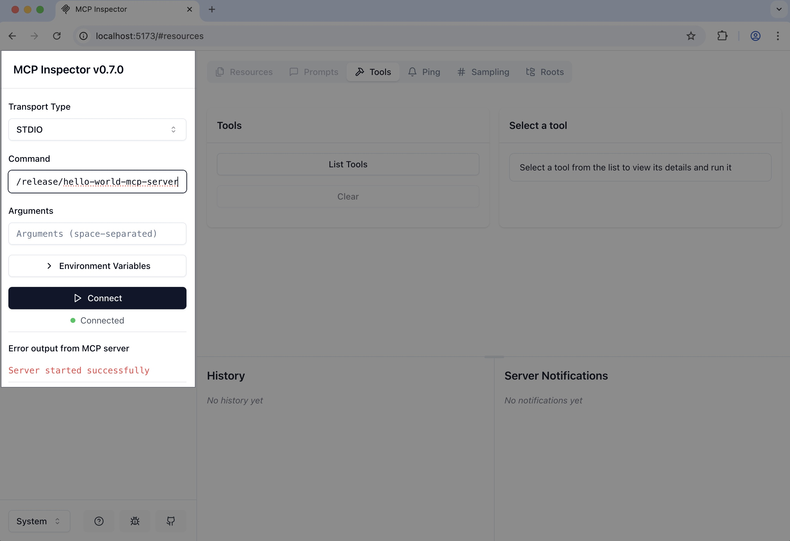
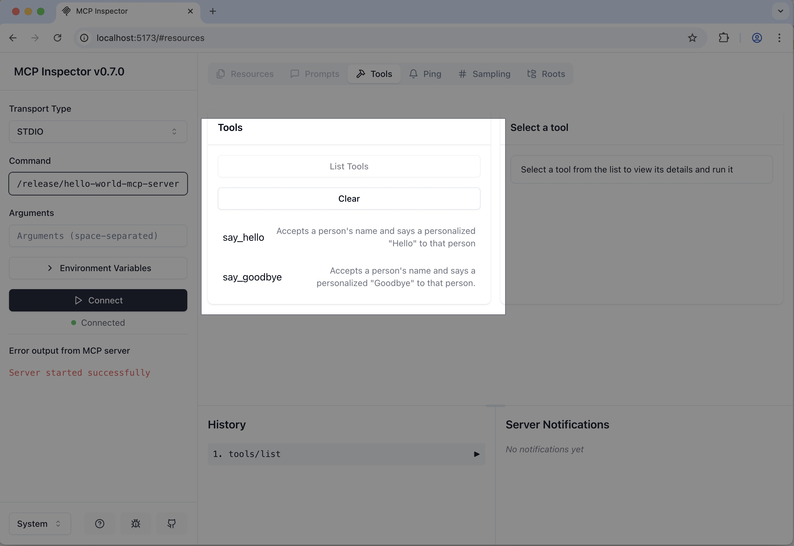
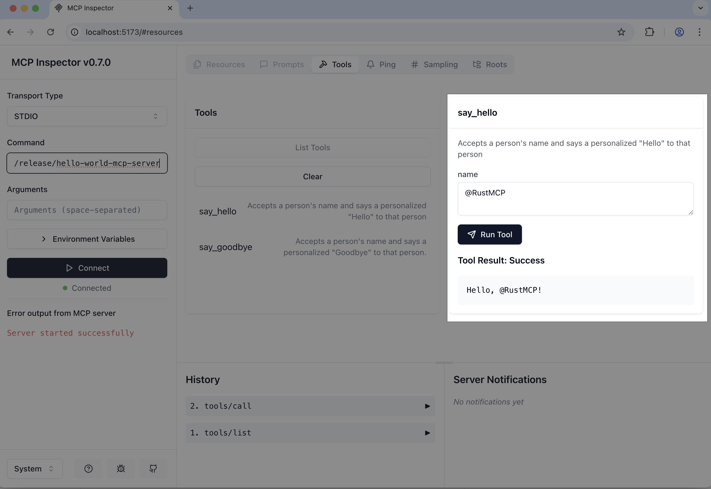

# Getting Started with Rust MCP SDK

This guide walks you through setting up and running an MCP server using the `rust-mcp-sdk` crate. Let's get your server up and running in minutes!

In this example, the MCP server we are building includes two MCP tools, `say_hello` and `say_goodbye`, which each take a name argument and print a personalized greeting message.

## Prerequisites

- Rust (install via [rustup](https://rustup.rs/))
- Cargo (comes with Rust)

## Step 1: Create a new project

Create a new Rust project:

```bash
cargo new hello-world-mcp-server
cd hello-world-mcp-server
```

## Step 2: Add Dependencies

Next, we’ll add the Rust MCP dependencies for the toolkit, schema, and runtime support. We’ll also include `tokio` and `async-trait` for async functionality, plus `serde` and `serde_json` to enable [rust-mcp-macros](https://crates.io/crates/rust-mcp-macros) for MCP tool development.

```sh
# rust-mcp dependencies
cargo add rust-mcp-sdk rust-mcp-schema

# other required dependencies
cargo add tokio async-trait serde serde_json
```

This is what your Cargo.toml looks like after the dependencies are added:

```toml
[package]
name = "hello-world-mcp-server"
version = "0.1.0"
edition = "2021"

[dependencies]
async-trait = "0.1.88"
rust-mcp-schema = "0.2.1"
rust-mcp-sdk = "0.1.1"
serde = "1.0.219"
serde_json = "1.0.140"
tokio = "1.44.1"
```

## Step3: update the `main()` function

Update `main()` function to use Tokio's asynchronous runtime and return `SdkResult<()>` from `rust_mcp_sdk` crate:

```rs
// src/main.rs
use rust_mcp_sdk::error::SdkResult;

#[tokio::main]
async fn main() -> SdkResult<()> {

    // The main function will be completed in the following steps.

    Ok(())
}
```

## Step 4: Define `say_hello` and `say_goodbye` tools

Create a new module in the project called `tools.rs` and include the definitions for the `say_hello` and `say_goodbye` tools within it.
`mcp_tool` and `JsonSchema` macros from [rust-mcp-macros](https://crates.io/crates/rust-mcp-macros) crate makes it very simple to turn any simple struct into legitimate MCP Tool:

```rust
//src/tools.rs
use rust_mcp_schema::{schema_utils::CallToolError, CallToolResult};
use rust_mcp_sdk::{
    macros::{mcp_tool, JsonSchema},
    tool_box,
};


//****************//
//  SayHelloTool  //
//****************//
#[mcp_tool(
    name = "say_hello",
    description = "Accepts a person's name and says a personalized \"Hello\" to that person"
)]
#[derive(Debug, ::serde::Deserialize, ::serde::Serialize, JsonSchema)]
pub struct SayHelloTool {
    /// The name of the person to greet with a "Hello".
    name: String,
}

impl SayHelloTool {
    pub fn call_tool(&self) -> Result<CallToolResult, CallToolError> {
        let hello_message = format!("Hello, {}!", self.name);
        Ok(CallToolResult::text_content(hello_message, None))
    }
}

//******************//
//  SayGoodbyeTool  //
//******************//
#[mcp_tool(
    name = "say_goodbye",
    description = "Accepts a person's name and says a personalized \"Goodbye\" to that person."
)]
#[derive(Debug, ::serde::Deserialize, ::serde::Serialize, JsonSchema)]
pub struct SayGoodbyeTool {
    /// The name of the person to say goodbye to.
    name: String,
}
impl SayGoodbyeTool {
    pub fn call_tool(&self) -> Result<CallToolResult, CallToolError> {
        let hello_message = format!("Goodbye, {}!", self.name);
        Ok(CallToolResult::text_content(hello_message, None))
    }
}

//******************//
//  GreetingTools  //
//******************//
// Generates an enum names GreetingTools, with SayHelloTool and SayGoodbyeTool variants
tool_box!(GreetingTools, [SayHelloTool, SayGoodbyeTool]);

```

## Step 5: Create a handler for handling MCP Messages

We need to create a handler for handling MCP messages including requests and notifications coming from the MCP Client.

> **Note:** [rust-mcp-sdk](https://github.com/rust-mcp-stack/rust-mcp-sdk) provides two type of handler traits that we can chose from:`mcp_server_handler` which is recommended for most use cases and `mcp_server_handler_core` which gives us more control but we will be responsible for every incoming request, notification and errors.

For this example we create a simple struct, and implement the `mcp_server_handler` for it, overriding two methods that we need :

- `handle_list_tools_request()` that returns list of available tools our server supports.
- `handle_call_tool_request()` that will be called when MCP Client requests our server to call a tool and return the result.

Lets do that, by adding a new module to the `main.rs` and creating the module file : `handler.rs`

Here is the code for `handler.rs` :

```rs
// src/handler.rs

use async_trait::async_trait;
use rust_mcp_schema::{
    schema_utils::CallToolError, CallToolRequest, CallToolResult, JsonrpcErrorError,
    ListToolsRequest, ListToolsResult,
};
use rust_mcp_sdk::{mcp_server::ServerHandler, MCPServer};

use crate::tools::GreetingTools;

// Custom Handler to handle MCP Messages
pub struct MyServerHandler;

#[async_trait]
impl ServerHandler for MyServerHandler {
    // Handle ListToolsRequest, return list of available tools as ListToolsResult
    async fn handle_list_tools_request(
        &self,
        request: ListToolsRequest,
        runtime: &dyn MCPServer,
    ) -> std::result::Result<ListToolsResult, JsonrpcErrorError> {
        Ok(ListToolsResult {
            meta: None,
            next_cursor: None,
            tools: GreetingTools::get_tools(),
        })
    }

    //Handles incoming CallToolRequest and processes it using the appropriate tool.
    async fn handle_call_tool_request(
        &self,
        request: CallToolRequest,
        runtime: &dyn MCPServer,
    ) -> std::result::Result<CallToolResult, CallToolError> {
        // Attempt to convert request parameters into GreetingTools enum
        let tool_params: GreetingTools =
            GreetingTools::try_from(request.params).map_err(CallToolError::new)?;

        // Match the tool variant and execute its corresponding logic
        match tool_params {
            GreetingTools::SayHelloTool(say_hello_tool) => say_hello_tool.call_tool(),
            GreetingTools::SayGoodbyeTool(say_goodbye_tool) => say_goodbye_tool.call_tool(),
        }
    }
}

```

## Step 6: Combine all components and create the Server!

Now we have all the components necessary for our MCP Server , we need to update our `main()` function to setup a MCP Server using our handler and fire it up!

To do that , we need to

- Define our MCP Server capabilities (which includes tools only in this example)
- Select a Transport (for now the only option is `std`)
- Create and start the server by passing server capabilities, transport and handle

Here is how final `main.rs` file looks like.

```rust
// src/main.rs
mod handler;
mod tools;
use handler::MyServerHandler;
use rust_mcp_schema::{
    Implementation, InitializeResult, ServerCapabilities, ServerCapabilitiesTools,
    LATEST_PROTOCOL_VERSION,
};

use rust_mcp_sdk::{
    error::SdkResult,
    mcp_server::{server_runtime, ServerRuntime},
    MCPServer, StdioTransport, TransportOptions,
};

#[tokio::main]
async fn main() -> SdkResult<()> {
    //Define server details and capabilities
    let server_details = InitializeResult {
        // server name and version
        server_info: Implementation {
            name: "Hello World MCP Server".to_string(),
            version: "0.1.0".to_string(),
        },
        capabilities: ServerCapabilities {
            // indicates that server support mcp tools
            tools: Some(ServerCapabilitiesTools { list_changed: None }),
            ..Default::default() // Using default values for other fields
        },
        meta: None,
        instructions: None,
        protocol_version: LATEST_PROTOCOL_VERSION.to_string(),
    };

    // create a std transport with default options
    let transport = StdioTransport::new(TransportOptions::default())?;

    //instantiate our custom handler for handling MCP messages
    let handler = MyServerHandler {};

    //create the MCP server
    let server: ServerRuntime = server_runtime::create_server(server_details, transport, handler);

    // Start the server
    server.start().await
}
```

## Lets test it out!

To test our server, we first need to compile it by executing:

```sh
cargo build --release
```

Generated binary will be available at `target/release/` folder

> Binary name matched your project name, `hello-world-mcp-server` or `hello-world-mcp-server.exe` on windows

Now we can use the binary like any other MCP Server in your desired environment. For testing purpose, we use [@modelcontextprotocol/inspector](https://www.npmjs.com/package/@modelcontextprotocol/inspector)

1- launch the mcp-inspector:

```sh
npx @modelcontextprotocol/inspector
```

> you will get a message like: `MCP Inspector is up and running at http://localhost:5173` 🚀

Open that address in a web browser:

2- Select STDIO as the transport, enter your binary path in the Command section, and click the Connect button. You should see a message confirming that your server started successfully.



3- Click **List Tools** button, to retrieve list of tools that your server provides:



4- Select one the tools, and run it py passing a `name` argument and pressing the **Run Tool** button:


